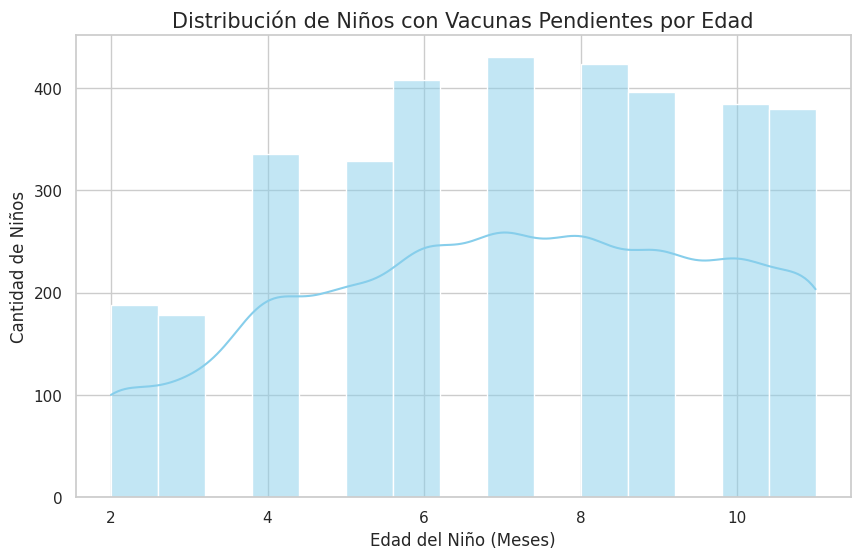

# seguimiento-vacunacion-ia
Sistema de detección nominal de brechas de inmunización en niños (Compromiso 1) usando Python
# Algoritmo de Vigilancia Nominal de Inmunizaciones (AVNI)
### Optimización del Seguimiento del Compromiso 1 - Salud Pública

Este repositorio contiene la implementación de un motor de reglas en Python diseñado para automatizar el cruce de datos del Padrón Nominal (PN) y el Esquema Nacional de Vacunación. El objetivo es identificar brechas de inmunización a nivel individual (nominal) para la gestión de brigadas en campo.

## 1. El Problema: Brecha entre Estadística y Operatividad

En la gestión de salud pública, los reportes tradicionales (Power BI o Tablas Dinámicas) ofrecen una visión estadística del avance de metas, pero carecen de **capacidad operativa**. 

Identificar manualmente a qué niños llamar o visitar entre miles de registros de Excel es ineficiente y propenso a errores. Este proyecto resuelve esa brecha, transformando datos masivos en **listas de búsqueda activa** con nombre, dirección y prioridad de riesgo.

## 2. Metodología y Procesamiento de Datos (Pipeline)

El flujo de trabajo de datos se divide en tres etapas críticas:

* **Ingesta y Limpieza (ETL):** Normalización de tipos de datos, manejo de registros `NaT` (Not a Time) en fechas de vacunación y eliminación de ruido en filas de metadatos de archivos fuente.
* **Lógica de Negocio (Motor de Reglas):** Evaluación dinámica de la edad cronológica en meses versus el cumplimiento de dosis (Pentavalente, Rotavirus, etc.).
* **Segmentación Operativa:** Clasificación de casos mediante una matriz de prioridad:
    * **Crítica:** Niños ≥ 6 meses con omisión de 1ra dosis (Penta1/Rota1).
    * **Alta:** Niños con retraso en esquemas de refuerzo.
    * **Media:** Seguimiento preventivo según calendario.

## 3. Resultados y Hallazgos

El procesamiento del dataset actual permitió:

* Identificar **1,465 casos nominales** con esquemas incompletos para intervención inmediata.
* Detectar que el mayor cuello de botella de deserción ocurre entre los **4 y 7 meses** de edad.
* Georeferenciar los casos por **IPRESS** (Establecimientos de Salud), facilitando la distribución de carga de trabajo por microredes.

> [!IMPORTANT]
> **Visualización de Resultados:** Aquí se observa la distribución de la población en mora por rangos de edad, permitiendo priorizar los grupos etarios más vulnerables.
> 

## 4. Stack Técnico

* **Lenguaje:** Python 3.x
* **Librerías principales:** * `Pandas`: Estructuración de DataFrames y lógica de filtrado.
    * `Matplotlib / Seaborn`: Análisis de distribución de frecuencias y visualización de brechas.
* **Entorno:** Google Colab.

---

**Nota:** Por razones de confidencialidad y cumplimiento de la Ley N° 29733 (Ley de Protección de Datos Personales en Perú), los datasets utilizados en este repositorio han sido anonimizados o contienen datos sintéticos para fines demostrativos.

